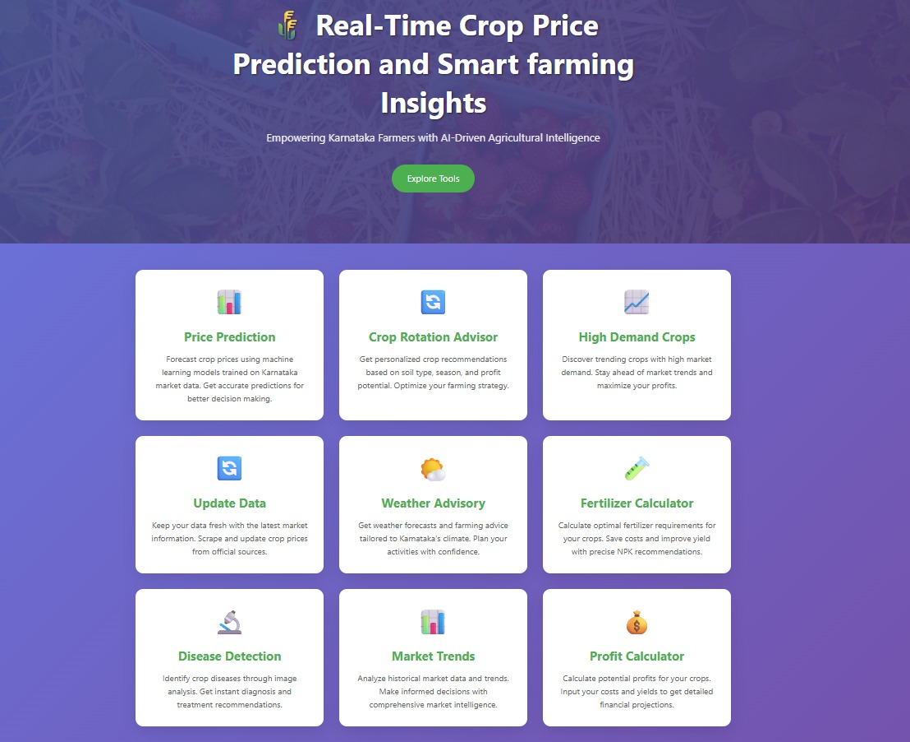

# Crop Price Prediction and Farm Management System

A comprehensive Flask-based web application for Karnataka farmers to predict crop prices, get crop recommendations, analyze market trends, and access farming tools.



## Features

### 🏷️ Price Prediction
- Machine learning-powered crop price forecasting
- Historical data analysis for accurate predictions
- District-wise market price insights
- Real-time price updates with web scraping

### 🌾 Crop Rotation & Recommendations
- AI-powered crop suggestion based on soil type, season, and previous crops
- Profit maximization recommendations
- Smart rotation to prevent pest cycles
- District-specific crop suitability analysis

### 📊 Market Trends & High Demand Crops
- Monthly high-demand crop analysis
- Market trend predictions
- Export potential identification
- Seasonal price pattern analysis

### 🌤️ Weather Advisory
- Real-time weather data integration (OpenWeatherMap API)
- Farming advisory based on weather conditions
- District-wise weather forecasts
- Crop-specific weather recommendations

### 💰 Profit Calculator
- Investment vs. revenue analysis
- Yield-based profit calculations
- Cost optimization suggestions
- Break-even analysis

### 🧪 Fertilizer Calculator
- NPK requirement calculations
- Cost-effective fertilizer recommendations
- Crop-specific nutrient planning

### 🔬 Disease Detection
- Symptom-based crop disease identification
- Treatment recommendations
- Prevention strategies

## Technology Stack

- **Backend:** Flask (Python)
- **Frontend:** HTML, CSS, JavaScript, Bootstrap
- **Machine Learning:** XGBoost, Scikit-learn
- **Data Processing:** Pandas, NumPy
- **Web Scraping:** BeautifulSoup, Selenium
- **Database:** CSV-based data storage
- **APIs:** OpenWeatherMap for weather data

## Installation & Setup

### Prerequisites
- Python 3.8+
- pip package manager

### Installation Steps

1. **Clone the repository:**
   ```bash
   git clone <repository-url>
   cd crop-price-prediction
   ```

2. **Install dependencies:**
   ```bash
   pip install -r requirements.txt
   ```

3. **Set up weather API (optional):**
   - Follow instructions in `weather_api_setup.md`
   - Get OpenWeatherMap API key
   - Update `app.py` with your API key

4. **Train the model (if needed):**
   ```bash
   python train_final_model.py
   ```

5. **Run the application:**
   ```bash
   python app.py
   ```

6. **Access the application:**
   - Open browser: `http://localhost:5001`

## Data Sources

- Karnataka Agriculture Department crop price data
- Historical market prices (last 90 days)
- District-wise commodity availability
- Seasonal crop patterns

## Project Structure

```
├── app.py                      # Main Flask application
├── train_final_model.py        # Model training script
├── multi_crop_scraper.py       # Web scraper for price data
├── final_complete_data.csv     # Historical crop price data
├── final_crop_model2.pkl       # Trained ML model
├── final_encoders.pkl          # Label encoders
├── templates/                  # HTML templates
│   ├── index.html
│   ├── welcome.html
│   ├── crop_rotation.html
│   ├── market_trends.html
│   └── ...
├── static/                     # CSS, JS, images
└── requirements.txt            # Python dependencies
```

## API Endpoints

- `GET /` - Welcome page
- `GET /dashboard` - Main dashboard
- `POST /api/predict` - Price prediction
- `POST /api/recommend-crop` - Crop recommendations
- `POST /api/analyze-demand` - High demand analysis
- `GET /api/weather/<district>` - Weather data
- `POST /api/calculate-profit` - Profit calculations

## Usage

1. **Price Prediction:**
   - Select district, market, commodity, variety, grade
   - Choose prediction date
   - Get instant price forecast

2. **Crop Recommendation:**
   - Input soil type, current month, previous crop, district
   - Get AI-powered crop suggestions with profit analysis

3. **Market Trends:**
   - Select district and month
   - View top high-demand crops with prices

4. **Weather Advisory:**
   - Choose district
   - Get current weather conditions and farming tips

## Contributing

1. Fork the repository
2. Create a feature branch
3. Make your changes
4. Test thoroughly
5. Submit a pull request

## License

This project is open-source and available under the MIT License.

## Support

For questions or issues, please create an issue in the repository or contact the development team.

---

**Note:** This application is designed specifically for Karnataka farmers and uses regional agricultural data. For other regions, data sources and models would need to be adapted.
